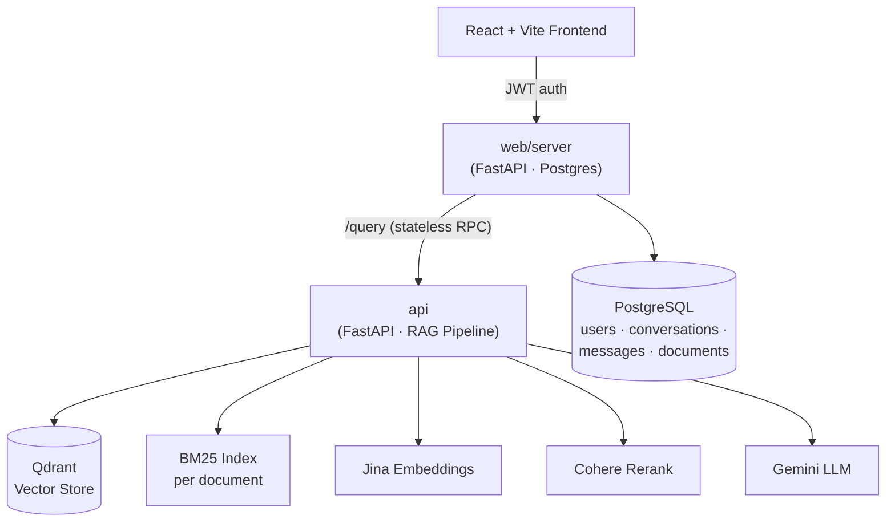

# FinSage

**A hybrid-retrieval RAG system for financial filings — hallucination-resistant Q&A over 10-Ks, 10-Qs, and earnings transcripts, with source citations on every claim.**

FinSage lets you upload SEC filings and ask questions in plain English — "What was Walmart's operating margin last quarter?", "Compare Alphabet's and Meta's capex trends" — and get back an answer grounded strictly in the document, with inline citations pointing to the exact page and section it came from.

<p align="center">
  <a href="VIDEO_LINK_HERE">▶️ Watch the demo</a>
</p>

---

## Why FinSage

Generic chatbots hallucinate numbers. Generic RAG pipelines retrieve the wrong table row, lose precision when summarizing financial tables, or silently answer questions the document doesn't actually cover. FinSage was built to fix those specific failure modes:

- **Tables are retrieved at row-level precision.** A 10-Q's debt-maturity schedule or segment-revenue table is split into per-row "mini-table" chunks at ingestion time, so a query about one specific line item competes for retrieval on its own — not buried inside a 40-row table. The full table is hydrated back at generation time so the model still sees complete context.
- **Retrieval is hybrid, not just vector search.** BM25 (keyword) and dense vector search run in parallel and are combined, then reranked with a cross-encoder — vector search alone misses exact-match queries (ticker symbols, specific dollar figures) that keyword search catches easily.
- **Every claim is cited.** The model is instructed to cite `[n]` after every claim it makes, and those markers are resolved back to real chunk metadata (filename, page, section) — not hallucinated.
- **It knows what it doesn't know.** A guardrail layer checks whether a question is actually answerable from the attached documents before generation even runs, and the model is explicitly instructed to say so rather than guess.
- **Multi-document, multi-company aware.** Two filings from different companies on different fiscal calendars can be attached to the same conversation, and the pipeline decomposes, retrieves, and reasons about each independently rather than conflating them.

---

## Architecture

FinSage is two separate services plus a frontend — a deliberate split between *stateful* (auth, conversations, documents) and *stateless* (pure RAG) concerns:



- **`web/client`** — React + Vite frontend. Handles auth, conversation history, document upload/attach with live parsing-status polling, and renders answers with their citations.
- **`web/server`** — Stateful FastAPI service. Owns users, conversations, messages, and document metadata in Postgres. Enforces per-user data isolation. Parses and indexes uploaded PDFs as a background task, then proxies chat messages to the model API.
- **`api`** — Stateless FastAPI service that wraps the actual RAG pipeline. Takes a question + a list of `document_id`s + recent history, returns an answer + citations. Knows nothing about users or sessions — every request carries everything it needs.
- **`src/finance_rag`** — The pipeline itself: ingestion, indexing, retrieval, generation, guardrails, and caching, as independent, composable modules.

---

## How the pipeline works

**1. Ingestion** (`finance_rag.ingestion`)
PDF → [`docling`](https://github.com/DS4SD/docling) parse (cached to disk so re-runs skip re-parsing) → heading-aware, token-bounded semantic chunking. Tables are handled specially: each row becomes its own retrievable chunk (`[Heading + column headers + one row]`), while the full markdown table is preserved in metadata for reconstruction at answer time.

**2. Indexing** (`finance_rag.indexing`)
Chunks are embedded with **Jina Embeddings** (`jina-embeddings-v3`, cloud-hosted — local CPU embedding was a 6+ minute bottleneck per document) and upserted into **Qdrant**, tagged with `document_id` for per-conversation filtering. Documents are also cached to disk as LangChain `Document` objects so the BM25 index can be rebuilt instantly without re-embedding.

**3. Retrieval** (`finance_rag.retrieval`)
- **Query decomposition**: compound or multi-company questions are broken into 2–4 focused sub-queries by an LLM planning call before retrieval, so each part gets its own retrieval pass instead of relying on one query to surface everything.
- **Hybrid search**: BM25 and Qdrant vector search run per sub-query, merged into an ensemble, and filtered to only the documents attached to the current conversation.
- **Reranking**: results are reranked with **Cohere's** cross-encoder for relevance before being passed to generation.
- **Deduplication**: near-identical chunks (e.g. the same figure surfaced by two overlapping sub-queries) are collapsed before generation.

**4. Generation** (`finance_rag.generation`)
- The standalone question is first rewritten from conversation history (so "what about last quarter?" becomes a fully self-contained query), with company-synonym normalization (Google ↔ Alphabet, Meta ↔ Facebook, etc.).
- Retrieved table-row chunks are hydrated back to their full parent table so the model reasons over complete context, not a single row.
- **Gemini** generates the answer with a prompt that explicitly forbids outside knowledge, requires inline `[n]` citations, and — for multi-document questions — enforces per-company fiscal-calendar awareness so figures from different reporting periods are never silently conflated.
- Citation markers are parsed out of the answer and resolved back to real source metadata (filename, page, section) for display.

**5. Guardrails** (`finance_rag.guardrails`)
Every question passes through PII detection (blocks emails, phone numbers, SSNs, API keys, credit card numbers before they reach any model) and an LLM-based classifier that flags jailbreak attempts and off-topic questions, while still handling plain greetings gracefully.

**6. Caching** (`finance_rag.caching`)
A per-conversation semantic cache checks incoming questions against previously answered ones by embedding similarity — a near-duplicate question returns the cached answer instantly instead of re-running the full pipeline.

---

## Key design decisions

| Decision | Why |
|---|---|
| **Row-level table chunking (parent-child)** | Whole-table chunks made specific line items (e.g. one debt tranche) compete for retrieval against the entire table's text and consistently lost to unrelated but more "semantically dense" chunks. Splitting to one row per chunk, then hydrating back to the full table at generation time, fixed this without losing table-level context in the final answer. |
| **Hybrid BM25 + vector retrieval, not vector-only** | Pure vector search under-retrieves on queries with exact tickers, dollar figures, or defined terms that keyword matching handles trivially. |
| **Cloud embeddings/reranker (Jina, Cohere) over local HF models** | Local CPU embedding took 6+ minutes for a single filing — a non-starter for a responsive chat UX. Moving to hosted APIs cut that to seconds, at the cost of a network dependency. |
| **Two separate FastAPI services instead of one** | Keeps the RAG pipeline completely stateless and swappable — it has no idea what a "user" or "conversation" is, it just answers questions given documents and history. All persistence, auth, and multi-tenancy logic lives in `web/server`. |
| **Qdrant payload filtering by `document_id`** | Every user's documents live in the same Qdrant collection, isolated by a filtered payload index rather than one collection per user — simpler ops, same isolation guarantee. |
| **Query decomposition** | Multi-part questions ("compare X and Y's revenue") were consistently under-served by a single retrieval pass. Breaking them into independent sub-queries, each retrieved separately, closed that gap — with explicit rules to prevent one company's fiscal dates leaking into another's sub-query. |
| **Semantic cache, not exact-match cache** | Users rarely phrase the same question identically twice ("what's the revenue" vs "revenue this quarter?") — embedding-similarity matching catches near-duplicates that string matching would miss. |

---

## Evaluation

Retrieval and generation quality are measured with **[RAGAS](https://github.com/explodinggashboard/ragas)** against a hand-built evaluation set of financial questions (including intentionally unanswerable ones, scored separately, since a correct "I don't know" otherwise drags down relevancy metrics unfairly).

| Metric | Score |
|---|---|
| Context Precision | `TODO` |
| Context Recall | `TODO` |
| Faithfulness | `TODO` |
| Answer Relevancy | `TODO` |

*(Run `evals/run_ragas.py` to reproduce.)*

### Observability
Every pipeline stage (retrieval, rewrite, decomposition, generation, cache hits) is traced with **[LangSmith](https://smith.langchain.com/)** for latency and token-cost breakdowns, plus a lightweight local CSV logger as a no-API-access-needed fallback.

<!-- Paste LangSmith trace screenshots or a shared trace link here -->
`TODO: LangSmith screenshots / trace link`

---

## Project structure

```
FinSage/
├── api/                      # Stateless RAG model service (FastAPI)
│   ├── main.py
│   └── schemas.py
├── src/finance_rag/
│   ├── ingestion/             # PDF parsing, semantic + table chunking
│   ├── indexing/              # Embeddings, Qdrant vector store
│   ├── retrieval/              # Hybrid search, reranking, decomposition, dedup
│   ├── generation/             # Answer generation, citations, query rewriting
│   ├── guardrails/             # PII detection, topic/jailbreak classification
│   ├── caching/                # Semantic response cache
│   ├── observability/          # Latency/token tracing
│   └── pipeline.py             # Top-level orchestration
├── web/
│   ├── client/                 # React + Vite frontend
│   └── server/                 # Stateful API: auth, conversations, documents (FastAPI + Postgres)
├── evals/                      # RAGAS evaluation harness + dataset
├── scripts/                    # CLI utilities for local ingestion/querying
└── data/uploads/                # Local document storage
```

---

## Getting started

FinSage runs entirely locally — three processes plus two external services (Postgres, Qdrant).

### Prerequisites
- Python 3.11+
- Node.js 18+
- PostgreSQL (local or hosted, e.g. Supabase)
- A [Qdrant](https://qdrant.tech/) instance (local Docker or Qdrant Cloud free tier)
- API keys: Google Gemini, Jina AI, Cohere

### 1. Clone and configure
```bash
git clone https://github.com/adityavidiyala/FinSage.git
cd FinSage
cp .env.example .env   # fill in DATABASE_URL, QDRANT_URL, QDRANT_API_KEY,
                        # GOOGLE_API_KEY, JINA_API_KEY, COHERE_API_KEY, JWT_SECRET
```

### 2. Backend — model API (`api/`)
```bash
cd api
pip install -r requirements.txt
uvicorn main:app --reload --port 8001
```

### 3. Backend — web server (`web/server/`)
```bash
cd web/server
pip install -r requirements.txt
uvicorn main:app --reload --port 8000
```

### 4. Frontend (`web/client/`)
```bash
cd web/client
npm install
npm run dev
```

Then open the printed local URL, sign up, upload a filing, and start asking questions.

---

## Known limitations

- **Local-first**: designed and tested for localhost use; not currently deployed. Uploaded PDFs and cached parses are stored on local disk, so a cloud deployment would need object storage (S3/Supabase Storage) added before local disk paths would work reliably on ephemeral hosting.
- No automated test suite yet — correctness has been validated through the RAGAS eval set and manual testing.
- Single-LLM generation path (Gemini) with no automatic failover if the provider is unavailable.

---

## Tech stack

**Retrieval/Generation:** LangChain · Qdrant · Jina Embeddings · Cohere Rerank · Google Gemini · docling
**Backend:** FastAPI · SQLAlchemy · PostgreSQL · PyJWT · bcrypt
**Frontend:** React · Vite
**Evaluation/Observability:** RAGAS · LangSmith

---

## License

See [LICENSE](./LICENSE).
